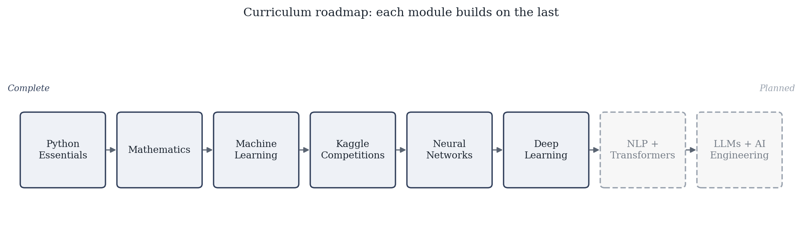

# ML → DS → DL → AI: A Practical, Progressive Curriculum

A hands-on, project-based path from Python fundamentals to AI Engineering — built progressively over a year of live teaching and still growing. Fork it, work through the modules in order, solve the exercises, and submit your solutions as a pull request.

## What's Inside



| # | Module | Covers | Status |
|---|--------|--------|--------|
| 1 | [Python Essentials](Python-Essentials) | Core Python exercises before touching data/ML | Complete |
| 2 | [Mathematics](Mathematics) | Algebra, equations, inequalities, sigma notation — the math ML actually uses | Complete |
| 3 | [Machine Learning](Machine-Learning) | Data preprocessing, EDA, supervised learning (regression, trees, SVM, KNN, Naive Bayes), unsupervised learning (clustering, PCA, t-SNE) | Complete |
| 4 | [Kaggle Competitions](Kaggle-Competition) | Applied end-to-end projects: House Prices, Instant Gratification | Complete |
| 5 | [Neural Networks](Neural-Networks) | Perceptron, tensors, PyTorch fundamentals | Complete |
| 6 | [Deep Learning](Deep-Learning) | CNNs, RNNs, LSTMs | Complete |
| 7 | NLP + Transformers | — | Planned |
| 8 | LLMs + AI Engineering | — | Planned |

Each module builds on the last — work through them in order for the intended learning path.

## Setup and Requirements

### What is Git?

Git is a version-control system — a time machine for your code. It lets you:

- Commit snapshots of your work.
- Revert to any earlier state.
- Experiment safely on branches.

### What is GitHub?

GitHub hosts Git repositories in the cloud and adds collaboration tools:

- Private/public storage for your code.
- Pull requests and code review.
- Issue tracking, CI workflows, and an online portfolio.

---

## Getting Started

> If you have read-only access: first fork the repository to your GitHub account, then clone your fork.
> If you have write access: you can clone the instructor's repo directly and skip the fork step.

### 1. Install Git

**macOS**

```bash
brew install git
```

**Windows**

1. Download Git for Windows: [https://git-scm.com/download/win](https://git-scm.com/download/win)
2. Run the installer and accept the defaults.
3. Verify installation:

```powershell
git --version
```

**Ubuntu / Debian**

```bash
sudo apt update
sudo apt install git
```

Configure your identity (one-time):

```bash
git config --global user.name  "Your Name"
git config --global user.email "you@example.com"
```

---

### 2. Install Python (≥ 3.9)

**macOS**

```bash
brew install python
```

**Windows**

1. Download from [https://python.org/downloads/windows/](https://python.org/downloads/windows/)
2. Check "Add Python to PATH" during installation.

**Ubuntu / Debian**

```bash
sudo apt update
sudo apt install python3 python3-pip python3-venv
```

### 3. Clone the Repository

If you're a student, you'll need to fork this repository to get read access and sync with updates:

1. Fork the repository: click the "Fork" button on the [main repository](https://github.com/rusterman/ML-DS-DL-AI) to create your own copy.
2. Clone your fork (replace `<your-username>` with your GitHub username):

```bash
git clone https://github.com/<your-username>/ML-DS-DL-AI.git
cd ML-DS-DL-AI
```

3. Add the instructor's repo as upstream (one-time, for syncing updates):

```bash
git remote add upstream https://github.com/rusterman/ML-DS-DL-AI.git
git remote -v   # origin = your fork, upstream = instructor
```

---

### 4. Create and Activate a Virtual Environment

**macOS / Linux**

```bash
python3 -m venv venv
source venv/bin/activate
```

**Windows (PowerShell)**

```powershell
python -m venv venv
.\venv\Scripts\activate
```

---

### 5. Install Project Dependencies

```bash
pip install --upgrade pip && pip install -r requirements.txt
```

### 6. Register the Jupyter Kernel

```bash
python -m ipykernel install --user --name ml-ai --display-name "ML-AI (Python 3.13)"
```

Then select "ML-AI (Python 3.13)" as the kernel when opening any notebook.

---

## Workflow for Students

Follow this simple Git workflow:

| Actor   | Step                              | Git Commands                                                  |
|---------|------------------------------------|-----------------------------------------------------------------|
| Participant | Create a personal solution branch  | `git checkout -b solutions/<username>`                          |
| Participant | Work locally, commit often         | `git add .`<br>`git commit -m "solve: exercise description"`    |
| Participant | Push solutions                     | `git push -u origin solutions/<username>`                        |

Replace `<username>` with your actual GitHub username.
